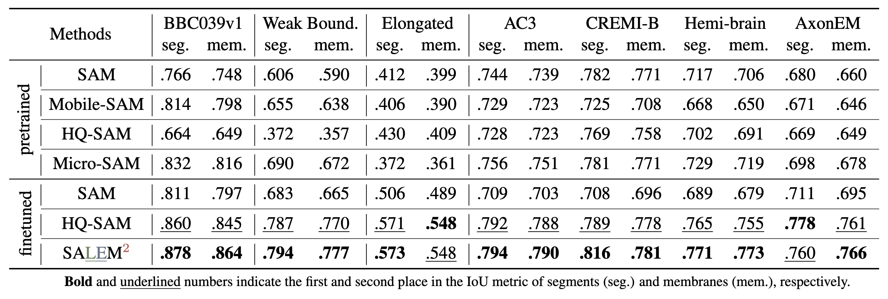

# ${\textrm{SA}}{\textcolor{HTML}{6D8764}\underline{\textrm{L}}}{\color{HTML}{647687}\underline{\textrm{E}}}{\textrm{M}^2}$

SALEM2: Segment Anything in Microscopy via Membrane Guidance

Codes and data collections will be released upon publication.

### Comparison with General-purpose Methods

Quantitative comparison: [SAM](https://github.com/facebookresearch/segment-anything), [HQ-SAM](https://github.com/SysCV/sam-hq), [Mobile-SAM](https://github.com/ChaoningZhang/MobileSAM) (from HQ-SAM) and [Micro-SAM](https://github.com/computational-cell-analytics/micro-sam), as well as trained SAM and HQ-SAM in both LM and EM datasets.

### Comparison with Specialized Supervised Methods

Qualitative comparison: [CellPose](https://github.com/MouseLand/cellpose) in LM, [ilastik](https://www.ilastik.org/) (pretrained models from [https://bioimage.io/#/?partner=ilastik](https://bioimage.io/#/?partner=ilastik)) and [superhuman](https://github.com/torms3/Superhuman) (onnx models from [https://github.com/seung-lab/DeepEM/releases](https://github.com/seung-lab/DeepEM/releases)) in EM.

