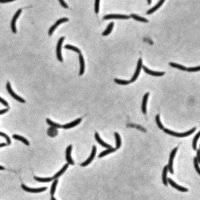
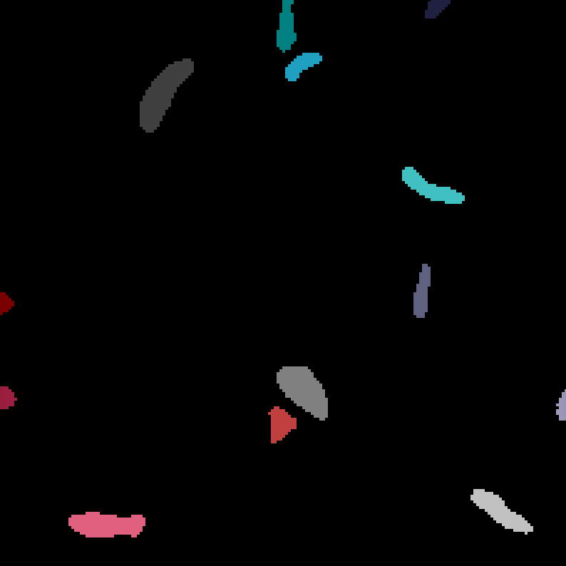
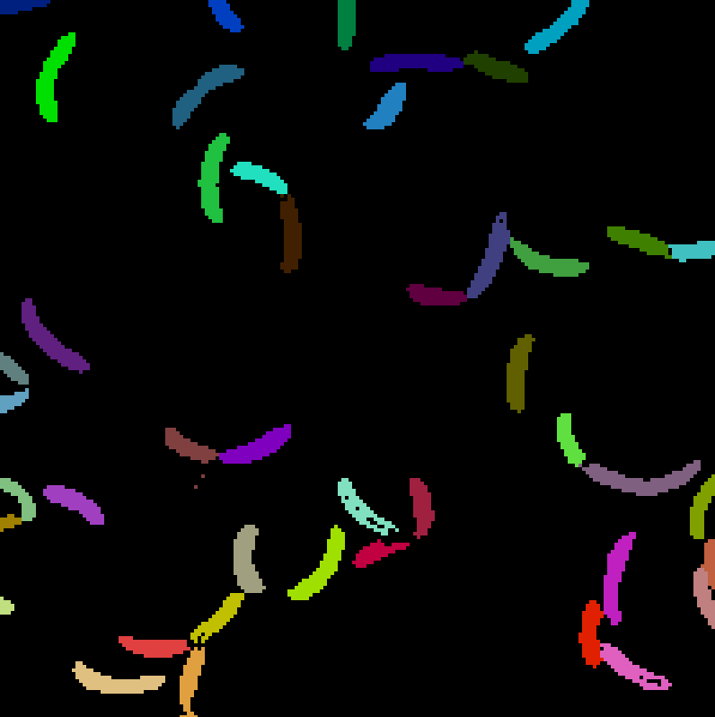
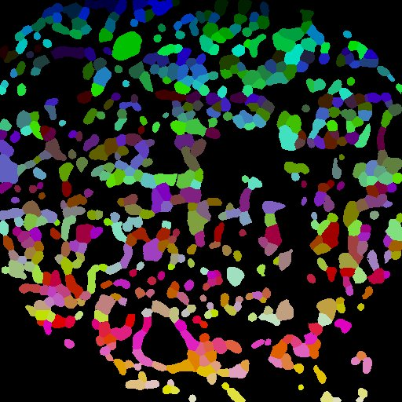
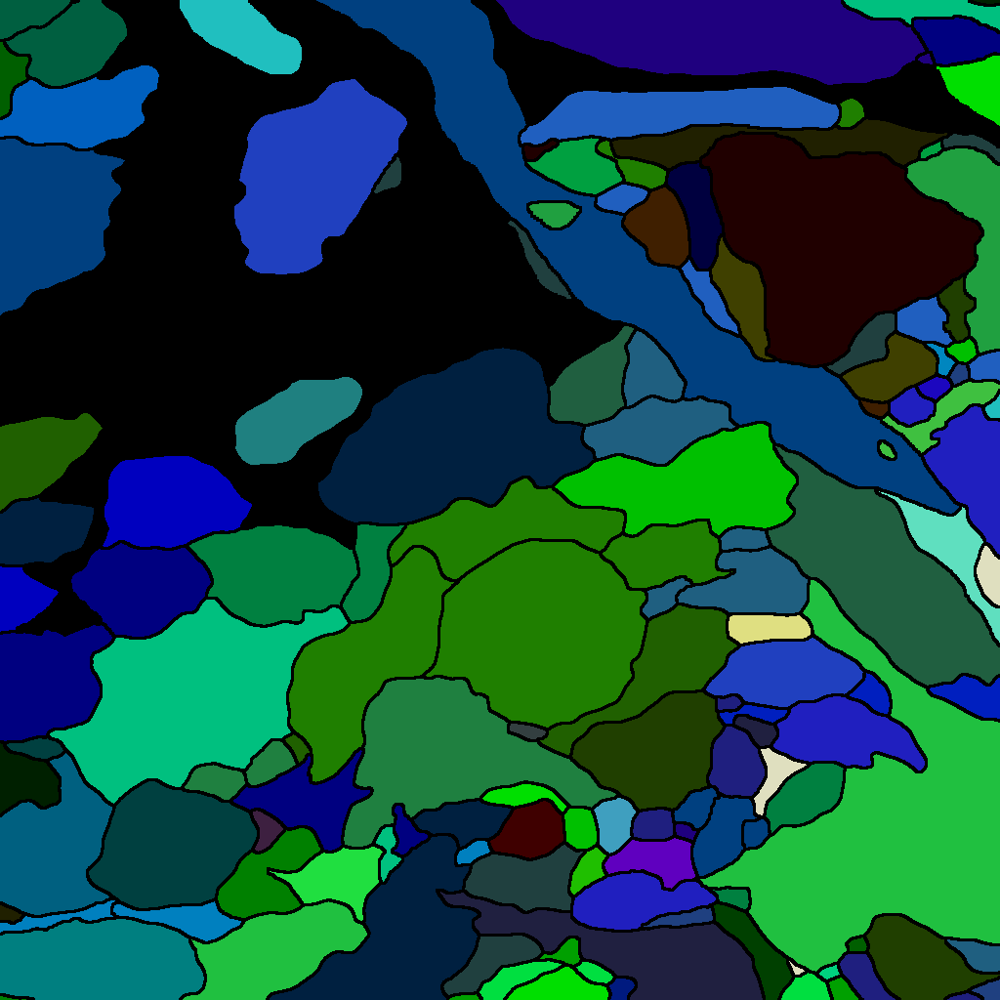

# 

SA<u>LE</u>M2: Segment Anything in <u>L</u>ight and <u>E</u>lectron <b>M</b>icroscopy via <b>M</b>embrane Guidance

 
(This figure has been modified to match the text in "Datasets" section.)

Codes and data collections will be released upon publication.

### Comparison with General-purpose Methods

Quantitative comparison: [SAM](https://github.com/facebookresearch/segment-anything), [HQ-SAM](https://github.com/SysCV/sam-hq), [Mobile-SAM](https://github.com/ChaoningZhang/MobileSAM) (from HQ-SAM) and [Micro-SAM](https://github.com/computational-cell-analytics/micro-sam), as well as trained SAM and HQ-SAM in both LM and EM datasets.

### Comparison with Specialized Supervised Methods

Qualitative comparison: [CellPose](https://github.com/MouseLand/cellpose) in LM, [ilastik](https://www.ilastik.org/) (pretrained models from [https://bioimage.io/#/?partner=ilastik](https://bioimage.io/#/?partner=ilastik)) and [Superhuman](https://github.com/torms3/Superhuman) (onnx models from [https://github.com/seung-lab/DeepEM/releases](https://github.com/seung-lab/DeepEM/releases)) in EM.

#### Elongated cells in LM:

<table>
    <tr>
        <td></td>
        <td></td>
        <td></td>
        <td></td>
        <td></td>
    </tr>
    <tr>
        <td>
Raw
</td>
        <td>
GT
</td>
        <td>
CellPose (<a href="http://dx.doi.org/10.1038/s41592-020-01018-x">Nat. Methods 2021</a>)
</td>
        <td>
OmniPose (<a href="http://dx.doi.org/10.1038/s41592-022-01639-4">Nat. Methods 2022</a>)
</td>
        <td>
SALM2 (Ours)
</td>
    </tr>
</table>

#### Weak boundaries in LM:

<table>
    <tr>
        <td></td>
        <td></td>
        <td></td>
        <td></td>
    </tr>
    <tr>
        <td>
Raw
</td>
        <td>
GT
</td>
        <td>
CellPose (<a href="http://dx.doi.org/10.1038/s41592-020-01018-x">Nat. Methods 2021</a>)
</td>
        <td>
SALM2 (Ours)
</td>
    </tr>
</table>

#### CREMI-B (blur and misalignment) in EM:

<table>
    <tr>
        <td></td>
        <td></td>
        <td></td>
        <td></td>
    </tr>
    <tr>
        <td>
Raw (sections 12-18)
</td>
        <td>
GT (sections 12-18)
</td>
        <td>
Superhuman (section 15) (<a href="http://dx.doi.org/10.1109/TMI.2021.3097826">IEEE Trans. Med. Imaging 2021</a>)
</td>
        <td>
SAEM2 (section 15) (Ours)
</td>
    </tr>
</table>

#### CREMI-C (blur and missing sections) in EM:

<table>
    <tr>
        <td></td>
        <td></td>
        <td></td>
        <td></td>
    </tr>
    <tr>
        <td>
Raw (sections 100-106)
</td>
        <td>
GT (sections 100-106)
</td>
        <td>
ilastik (section 103) (<a href="http://dx.doi.org/10.1038/s41592-019-0582-9">Nat. Methods 2019</a>)
</td>
        <td>
SAEM2 (section 103) (Ours)
</td>
    </tr>
</table>

More results can be found in Google Drive: [BBC039](https://drive.google.com/drive/folders/1VsXcneTsRx5YMzfkZyKcWtbndbpjnm1m?usp=sharing), [NeurIPS22-CellSeg](https://drive.google.com/drive/folders/1BG9F-LRvL9JaDYOige8bn-S1TWCX1kDE?usp=sharing) and [CREMI](https://drive.google.com/drive/folders/1xrIDpgqlOEVcaKmnbrCNFaaKRvHCfZWW?usp=sharing). We used CellPose and OmniPose with the configurations of `nuclei (flow_threshold=0.3)` for Bare Nuclei, `tissuenet (flow_threshold=0.6)` for Weak Boundary, `nuclei (flow_threshold=0.6)` and `bact_phase_omni` for Elongated. We used the open-sourced trained models of ilastik and Superhuman with alternative [preprocessing](https://github.com/JackieZhai/SALEM2/blob/master/assets/NcremiB.gif) steps.

### Contributors

* [Hao Zhai](https://github.com/JackieZhai)
* [Jinyue Guo](https://github.com/fenglingbai)
* [Yanchao Zhang](https://github.com/Cristand)

Thanks to the other authors and [MiRA Team](https://github.com/MiRA-Han-Lab) for their support and resources.

### Acknowledgments

* [SAM](https://github.com/facebookresearch/segment-anything)
* [HQ-SAM](https://github.com/SysCV/sam-hq)
* [Micro-SAM](https://github.com/computational-cell-analytics/micro-sam)
* [Mobile-SAM](https://github.com/ChaoningZhang/MobileSAM)

Thanks for their public code and released models.
